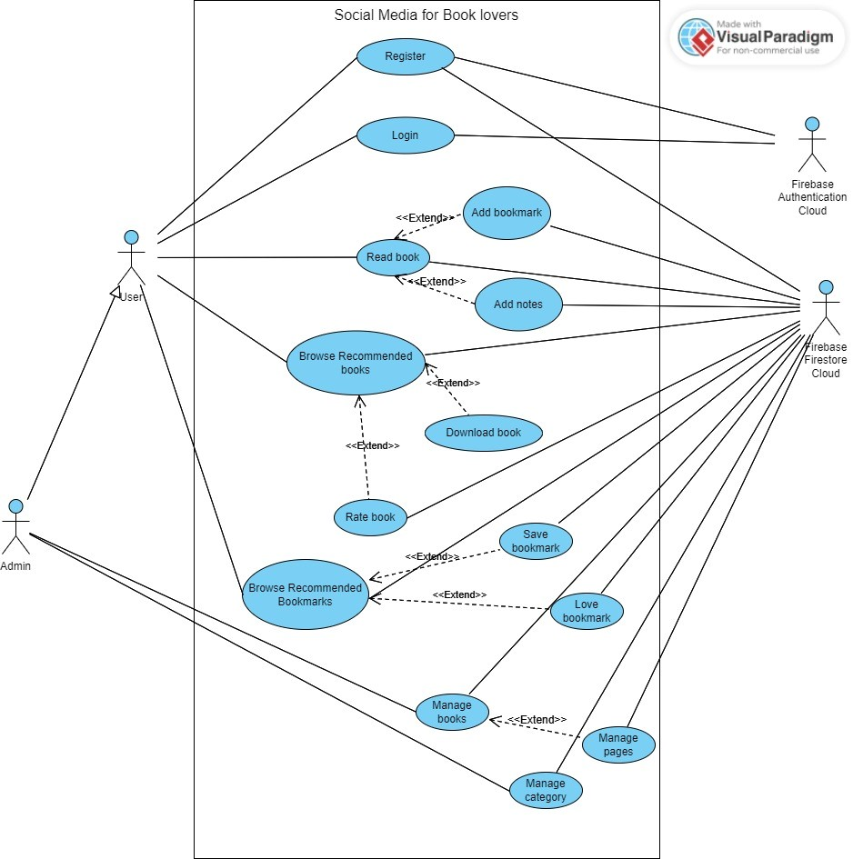
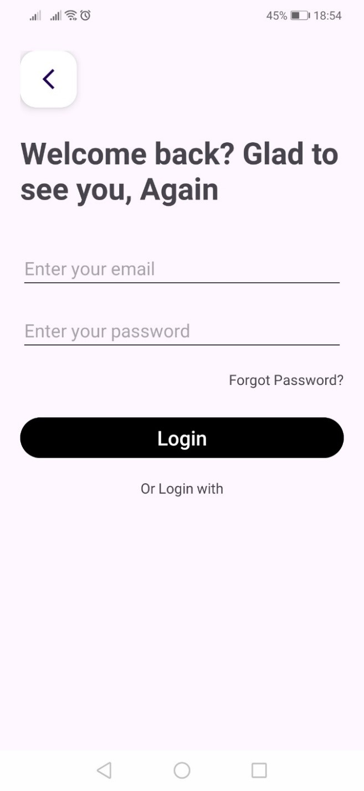

# EBookApplication

EBookApplication is an Android application that allows users to register, login, read books, add bookmarks and notes, browse recommended books, download books, rate books, and save or love bookmarks. Admin users have additional capabilities to manage books and categories.

## Features

### User Features

- **Registration and Login**: Users can register and login using Firebase Authentication.
- **Read Books**: Users can read books stored in the application.
- **Add Bookmarks**: Users can add bookmarks to books they are reading.
- **Add Notes**: Users can add notes to their bookmarks for future reference.
- **Browse Recommended Books**: Users can browse books recommended based on their reading history.
- **Download Books**: Users can download books for offline reading.
- **Rate Books**: Users can rate books they have read.
- **Browse Recommended Bookmarks**: Users can browse bookmarks recommended based on previous reading attempts.
- **Save or Love Bookmarks**: Users can save or mark bookmarks as loved.

### Admin Features

- **Manage Books**: Admins can manage the books available in the application, including adding, updating, or removing book pages.
- **Manage Categories**: Admins can manage the categories under which books are listed.

## Technologies Used

- **Firebase Authentication**: Used for user registration and login.
- **Firebase Firestore**: Used to store user data, books, bookmarks, notes, and ratings.
- **MVVM Pattern**: Implemented to separate the user interface from the business logic and data handling.
- **Room Database**: Used for storing downloaded books for offline access.


## UI 
### Login and Logout
- [Login and Logout](https://drive.google.com/file/d/1atL05ABj5okVO8k00rjD2vraR0DkcHB-/view?usp=drive_link)
### Register
- [Register](https://drive.google.com/file/d/1aroEOFwvsmF2wTEeDfqOwKPy3BHMmmHb/view?usp=sharing)
### Read Downloaded Books (automatically updates the most recently read books)
- [Read Downloaded Books](https://drive.google.com/file/d/1b2Yf2sMJomoaZt3Lxf9XnFCcc_QP2a2N/view?usp=drive_link)
### Add Note to Bookmark
- [Add Note to Bookmark](https://drive.google.com/file/d/1athRSkrtfj_kFnyqOH0beLcMJM4hQcNV/view?usp=drive_link)
### Add Bookmark for Book
- [Add Bookmark for Book](https://drive.google.com/file/d/1azKSQQBlsHDNXvXEIKc_UMUHRDatY-h_/view?usp=drive_link)
### Download Book
- [Download Book](https://drive.google.com/file/d/1b0U-urTYSKnAlPgneMShG2R1patKAtbm/view?usp=drive_link)
### Rate Book
- [Rate Book](https://drive.google.com/file/d/1bAazzu_CxNYAcOYBGcwqyC7TfFD1iUeE/view?usp=drive_link)
### Browse Suitable Books
- [Browse Suitable Books](https://drive.google.com/file/d/1b4NdY_ti0frz6P2TJeO29ItVMUer2AnQ/view?usp=drive_link)
### Browse and Interact with Bookmarks (like and save as on TikTok in real-time)
- [Browse and Interact with Bookmarks](https://drive.google.com/file/d/1bMlAt6fp36cTVBCb8VGBQGBSdnJLFmMn/view?usp=drive_link)
### Save User Preferences via Interaction (Reading Books)
- [Save User Preferences via Interaction](https://drive.google.com/file/d/1baIO90muSWoyaBsd-kfuFGrEMs3rOVh7/view?usp=drive_link)

## Installation and Setup

### Clone the Repository:
1. Clone the repository using the command:
    ```bash
    git clone https://github.com/your-repository-url.git
    ```

### Open the Project in Android Studio:
1. Open Android Studio.
2. Select **Open an existing Android Studio project**.
3. Navigate to the cloned directory and select it.

### Configure Firebase:
1. Go to the [Firebase Console](https://console.firebase.google.com/).
2. Create a new project or select an existing project.
3. Add an Android app to your Firebase project.
4. Download the `google-services.json` file.
5. Place the `google-services.json` file in the `app` directory of your project.
6. Ensure Firebase Authentication and Firestore are enabled in your Firebase project.

### Build the Project:
1. Ensure all necessary dependencies are installed.
2. Sync the project with Gradle files.

### Run the Application:
1. Connect an Android device or use an emulator.
2. Click **Run** in Android Studio.

## Usage

### Registration and Login:
1. Open the app and register a new account or login with existing credentials.

### Read Books:
1. Select a book from the library to start reading.

### Add Bookmarks and Notes:
1. While reading a book, click on the bookmark icon to add a bookmark and notes.

### Browse Recommended Books:
1. Browse through the recommended books section for new reading suggestions.

### Download Books:
1. Click on the download button to save books for offline reading.

### Rate Books:
1. After reading a book, rate it to help other users with their reading choices.

### Admin Management:
1. Admin users can log in to access additional management features for books and categories.

## Contributing
Contributions are welcome! Please fork this repository and submit pull requests.

## License
This project is licensed under the MIT License - see the [LICENSE](LICENSE) file for details.

## Contact
If you have any questions or suggestions, please contact [your email] or create an issue 
